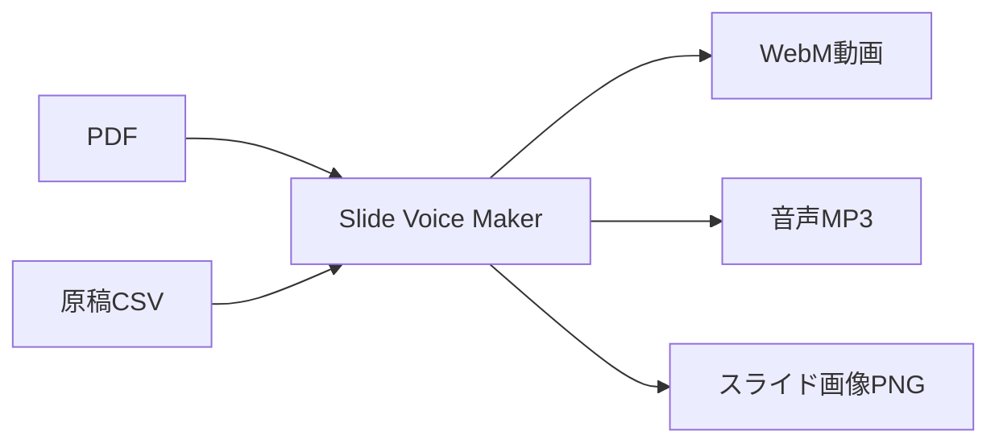

# Slide Voice Maker

PDFスライドと原稿CSVから、AI音声ナレーション付き動画（WebM）を自動生成するツールです。

**バージョン**: 1.0.0  
**日付**: 2026-01-05  
**リポジトリ**: https://github.com/J1921604/Slide-Voice-Maker

## 📦 機能概要



### 主要機能

| 機能 | 説明 |
|------|------|
| **PDF入力** | inputフォルダにPDFファイルを上書き保存 |
| **原稿CSV入力** | inputフォルダにCSVファイルを上書き保存 |
| **解像度選択** | 720p/1080p/1440pから選択 |
| **音声生成** | Edge TTSでAI音声を生成 |
| **動画出力** | output/tempに一時ファイル、output/に動画webm出力 |
| **原稿CSV出力** | 編集した原稿をCSVでダウンロード |
| **動画WebM出力** | outputフォルダから選択したwebmをダウンロード |

## 🚀 クイックスタート

### 1. 環境準備

```bash
# Python 3.10.11で仮想環境を作成
py -3.10 -m venv .venv
.venv\Scripts\activate

# 依存パッケージをインストール
pip install -r requirements.txt
```

### 2. ワンクリック起動

```bash
# start.batをダブルクリック、または
start.bat
```

### 3. 手動でサーバー起動

```bash
py -3.10 -m uvicorn src.server:app --host 127.0.0.1 --port 8000
```

### 4. ブラウザでアクセス

```
http://127.0.0.1:8000
```

### 4. 動画生成手順

1. **PDFアップロード**: プレゼンテーションPDFをアップロード
2. **原稿CSV読み込み**: 「index,script」形式のCSVを読み込み
3. **解像度選択**: 720p/1080p/1440pを選択
4. **音声生成**: 「音声生成」ボタンをクリック
5. **動画ダウンロード**: 「動画WebM出力」でダウンロード

### CLIで直接実行

```bash
# 基本実行
py -3.10 src\main.py

# 解像度指定（720p/1080p/1440p）
py -3.10 src\main.py --resolution 1080p

# フルオプション指定
py -3.10 src\main.py --input input --output output --script input\原稿.csv --resolution 1080p
```

## 🎥 解像度オプション

| オプション | 解像度 | 用途 |
|-----------|--------|------|
| `720p` | 1280×720 | Web配信、ファイルサイズ優先（デフォルト） |
| `1080p` | 1920×1080 | プレゼンテーション、標準品質 |
| `1440p` | 2560×1440 | 高品質、大画面表示 |

## 📋 必要条件

- **Python 3.10.11** (推奨)
- **FFmpeg** (imageio-ffmpegで自動インストール)
- 依存パッケージ: `pip install -r requirements.txt`

## 📁 ファイル構成

```
Slide-Voice-Maker/
├── index.html          # WebアプリUI
├── start.bat           # ワンクリック起動スクリプト
├── requirements.txt    # Python依存パッケージ
├── pytest.ini          # pytest設定
├── input/
│   ├── *.pdf           # 入力PDFファイル
│   └── 原稿.csv        # ナレーション原稿
├── output/
│   ├── *.webm          # 生成された動画
│   └── temp/           # 一時ファイル（自動クリア）
├── src/
│   ├── main.py         # CLIエントリポイント
│   ├── processor.py    # PDF処理・動画生成
│   └── server.py       # FastAPIサーバー
├── tests/
│   └── e2e/            # E2Eテスト
├── docs/               # ドキュメント
└── specs/              # 仕様書
```

## 📝 原稿CSV形式

```csv
index,script
0,"最初のスライドの原稿テキストをここに記載します。"
1,"2番目のスライドの原稿です。複数行も可能です。"
2,"3番目のスライドの原稿。"
```

- **index**: スライド番号（0から開始）
- **script**: 読み上げ原稿テキスト
- **文字コード**: UTF-8（BOM付き推奨）、Shift_JIS、EUC-JP対応

## ⚙️ 環境変数設定

動画生成のパラメータを環境変数で調整できます：

| 変数名 | デフォルト | 説明 |
|--------|-----------|------|
| `USE_VP8` | `1` | VP8使用（高速）。`0`でVP9（高品質）。 |
| `VP9_CPU_USED` | `8` | エンコード速度（0-8、大きいほど高速） |
| `VP9_CRF` | `40` | 品質（大きいほど低品質・高速） |
| `OUTPUT_FPS` | `15` | 出力FPS |
| `OUTPUT_MAX_WIDTH` | `1280` | 出力最大幅（px） |
| `SLIDE_RENDER_SCALE` | `1.5` | PDF→画像の解像度倍率 |
| `SILENCE_SLIDE_DURATION` | `5` | 原稿なしスライドの表示秒数 |

## ✅ テスト

```bash
# E2Eテスト（解像度・非空WebM）
py -3.10 -m pytest -m e2e -v

# ローカルバックエンドE2Eテスト
py -3.10 -m pytest tests/e2e/test_local_backend.py -v

# 解像度E2Eテスト
py -3.10 -m pytest tests/e2e/test_resolution.py -v
```

Playwrightのブラウザが未導入の場合：

```bash
py -3.10 -m playwright install chromium
```

## 📊 パフォーマンス改善

動画生成が遅い場合：

```bash
# VP8コーデック使用（デフォルト有効）
set USE_VP8=1

# 解像度を下げる
set OUTPUT_MAX_WIDTH=960
set SLIDE_RENDER_SCALE=1.0

# FPSを下げる（静止画ベースなので問題なし）
set OUTPUT_FPS=10
```

## 🐛 トラブルシューティング

### 文字化けする場合

原稿CSVをUTF-8（BOM付き）で保存してください。メモ帳の場合：
- 「名前を付けて保存」→ 文字コード: `UTF-8 (BOM付き)`

### FFmpegエラー

imageio-ffmpegが自動でFFmpegをダウンロードしますが、問題がある場合：

```bash
pip install --upgrade imageio-ffmpeg
```

### 音声が生成されない

Edge TTSはインターネット接続が必要です。ネットワークを確認してください。

### ローカルバックエンドが検出されない

サーバーを起動してください：

```bash
# ワンクリック起動
start.bat

# または手動起動
py -3.10 -m uvicorn src.server:app --host 127.0.0.1 --port 8000
```

## 📚 ドキュメント

| ドキュメント | 説明 |
|-------------|------|
| [完全仕様書](https://github.com/J1921604/Slide-Voice-Maker/blob/main/docs/完全仕様書.md) | 詳細な機能仕様 |
| [spec.md](https://github.com/J1921604/Slide-Voice-Maker/blob/main/specs/001-Slide-Voice-Maker/spec.md) | 機能仕様書 |
| [plan.md](https://github.com/J1921604/Slide-Voice-Maker/blob/main/specs/001-Slide-Voice-Maker/plan.md) | 実装計画 |
| [tasks.md](https://github.com/J1921604/Slide-Voice-Maker/blob/main/specs/001-Slide-Voice-Maker/tasks.md) | タスク一覧 |

## 📄 ライセンス

MIT License

## 🙏 クレジット

- [Edge TTS](https://github.com/rany2/edge-tts) - Microsoft Edge音声合成
- [PyMuPDF](https://pymupdf.readthedocs.io/) - PDF処理
- [MoviePy](https://zulko.github.io/moviepy/) - 動画編集（フォールバック用）
- [FastAPI](https://fastapi.tiangolo.com/) - Webフレームワーク
