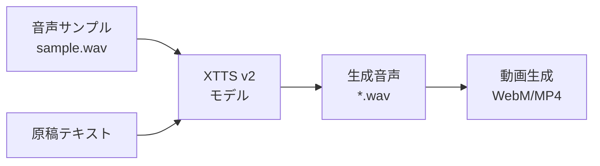
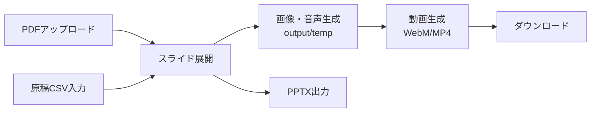

# Slide MyVoice Maker

PDFスライドと原稿CSVから、AI音声ナレーション付き動画（WebM）を自動生成するツールです。

**バージョン**: 1.0.0  
**日付**: 2026-1-5  
**リポジトリ**: https://github.com/J1921604/Slide-MyVoice-Maker

## 🎯 音声生成技術

### Coqui TTS (XTTS v2)

このプロジェクトは **Coqui TTS（XTTS v2）** を使用して、あなた自身の声を使った音声ナレーションを生成します。



#### 特徴

- **自分の声**: わずか3-10秒の音声サンプルで、あなたの声を再現
- **多言語対応**: 日本語を含む複数言語に対応
- **オープンソース**: 完全にオープンソースで、ローカル実行可能
- **高品質**: 自然な抑揚とイントネーションを再現

#### 音声サンプル作成

```bash
# 音声サンプルを録音
py -3.10 src\voice\create_voice.py
```

録音後、`src/voice/models/samples/sample.wav` が自動的に使用されます。

## 📦 機能概要



### 主要機能

| 機能 | 説明 |
|------|------|
| **PDF入力** | PDFファイルをアップロードしスライドとして展開 |
| **原稿CSV入力** | inputフォルダにCSVファイルを上書き保存 |
| **解像度選択** | 720p/1080p/1440pから選択（画像解像度） |
| **再生速度** | 0.5x〜2.0xで音声再生速度を調整 |
| **字幕ON/OFF** | 動画に字幕を埋め込むかどうかを選択 |
| **画像・音声生成** | Coqui TTS（XTTS v2）でAI音声を生成、output/tempに画像・音声を保存 |
| **動画生成** | output/tempから動画WebM/MP4を生成（PDFと同名で保存） |
| **原稿CSV出力** | 編集した原稿をCSVでダウンロード |
| **動画出力** | outputフォルダから選択したWebM/MP4をダウンロード |
| **PPTX出力** | ブラウザ上でスライド画像をPPTX化してダウンロード |

## 🚀 クイックスタート

### 1. 環境準備

```bash
# Python 3.10.11で仮想環境を作成
py -3.10 -m venv .venv
.venv\Scripts\activate

# 依存パッケージをインストール
pip install -r requirements.txt
```

### 2. ワンクリック起動

```powershell
# start.ps1を右クリック→「PowerShellで実行」、または
powershell -ExecutionPolicy Bypass -File start.ps1
```

### 3. 手動でサーバー起動

```bash
py -3.10 -m uvicorn src.server:app --host 127.0.0.1 --port 8000
```

### 4. ブラウザでアクセス

```
http://127.0.0.1:8000
```

### 4. 動画生成手順

1. **PDFアップロード**: 「PDF入力」でPDFをアップロード（input/にも保存）
2. **原稿CSV読み込み**: 「原稿CSV入力」でCSVを読み込み、毎回input/原稿.csvに上書き保存
3. **解像度/字幕/形式選択**: 720p/1080p/1440p・字幕ON/OFF・WebM/MP4を選択
4. **画像・音声生成**: 「画像・音声生成」でoutput/tempをクリアし素材を再生成
5. **動画生成**: 「動画生成」でoutput/にPDF同名のWebM/MP4を出力
6. **ダウンロード**: 「動画出力」で保存済みWebM/MP4をダウンロード、「原稿CSV出力」「PPTX出力」も利用可

### CLIで直接実行

```bash
# 基本実行
py -3.10 src\main.py

# 解像度指定（720p/1080p/1440p）
py -3.10 src\main.py --resolution 1080p

# フルオプション指定
py -3.10 src\main.py --input input --output output --script input\原稿.csv --resolution 1080p
```

## 🎥 解像度オプション

| オプション | 解像度 | 用途 |
|-----------|--------|------|
| `720p` | 1280×720 | Web配信、ファイルサイズ優先（デフォルト） |
| `1080p` | 1920×1080 | プレゼンテーション、標準品質 |
| `1440p` | 2560×1440 | 高品質、大画面表示 |

## 📋 必要条件

- **Python 3.10.11** (推奨)
- **FFmpeg** (imageio-ffmpegで自動インストール)
- 依存パッケージ: `pip install -r requirements.txt`

## 📁 ファイル構成

```
Slide-MyVoice-Maker/
├── index.html          # WebアプリUI（GitHub Pages静的配信対応）
├── start.ps1           # ワンクリック起動スクリプト
├── requirements.txt    # Python依存パッケージ
├── pytest.ini          # pytest設定
├── input/
│   ├── *.pdf           # 入力PDFファイル
│   └── 原稿.csv        # ナレーション原稿
├── output/
│   ├── *.webm          # 生成された動画（MP4も対応）
│   └── temp/           # 一時ファイル（自動クリア）
├── src/
│   ├── main.py         # CLIエントリポイント
│   ├── processor.py    # PDF処理・動画生成
│   └── server.py       # FastAPIサーバー
├── tests/
│   └── e2e/            # E2Eテスト
├── docs/               # ドキュメント
└── specs/              # 仕様書
```

## 📝 原稿CSV形式

```csv
index,script
0,"最初のスライドの原稿テキストをここに記載します。"
1,"2番目のスライドの原稿です。複数行も可能です。"
2,"3番目のスライドの原稿。"
```

- **index**: スライド番号（0から開始）
- **script**: 読み上げ原稿テキスト
- **文字コード**: UTF-8（BOM付き推奨）、Shift_JIS、EUC-JP対応

## ⚙️ 環境変数設定

動画生成のパラメータを環境変数で調整できます：

| 変数名 | デフォルト | 説明 |
|--------|-----------|------|
| `USE_COQUI_TTS` | `1` | Coqui TTS使用（`0`で音声生成無効） |
| `COQUI_SPEAKER_WAV` | `src/voice/models/samples/sample.wav` | Coqui TTSの話者サンプル音声パス |
| `USE_VP8` | `1` | VP8使用（高速）。`0`でVP9（高品質）。 |
| `VP9_CPU_USED` | `8` | エンコード速度（0-8、大きいほど高速） |
| `VP9_CRF` | `40` | 品質（大きいほど低品質・高速） |
| `OUTPUT_FPS` | `30` | 出力FPS（字幕切り替わり確保のため30fps推奨） |
| `OUTPUT_MAX_WIDTH` | `1280` | 出力最大幅（px） |
| `SLIDE_RENDER_SCALE` | `1.5` | PDF→画像の解像度倍率 |
| `SILENCE_SLIDE_DURATION` | `5` | 原稿なしスライドの表示秒数 |
| `SUBTITLE_MARGIN_V` | `10` | 字幕の縦マージン（下寄せ調整） |
| `SUBTITLE_ALIGNMENT` | `2` | 字幕配置（2=bottom-center） |

## ✅ テスト

```bash
# E2Eテスト（解像度・非空WebM/MP4）
py -3.10 -m pytest -m e2e -v

# バックエンドE2Eテスト
py -3.10 -m pytest tests/e2e/test_local_backend.py -v

# 解像度E2Eテスト
py -3.10 -m pytest tests/e2e/test_resolution.py -v
```

## 📊 パフォーマンス改善

### 最新の最適化（1.0.0）

- **FPS 30fps**: 字幕切り替わりを確実にするため30fpsに変更（従来15fps）
- **全CPUコア活用**: FFmpegスレッド数の制限を解除し、全コア並列処理
- **字幕最小セグメント時間**: 0.15秒に設定し、確実に切り替わるよう改善
- **VP8デフォルト**: 高速エンコードのためVP8をデフォルト有効化

### 動画生成が遅い場合

```bash
# VP8コーデック使用（デフォルト有効）
set USE_VP8=1

# 解像度を下げる
set OUTPUT_MAX_WIDTH=960
set SLIDE_RENDER_SCALE=1.0

# FPSを下げる（ただし字幕切り替わりに影響する可能性あり）
set OUTPUT_FPS=20
```

## 🐛 トラブルシューティング

### 文字化けする場合

原稿CSVをUTF-8（BOM付き）で保存してください。メモ帳の場合：
- 「名前を付けて保存」→ 文字コード: `UTF-8 (BOM付き)`

### FFmpegエラー

imageio-ffmpegが自動でFFmpegをダウンロードしますが、問題がある場合：

```bash
pip install --upgrade imageio-ffmpeg
```

### 音声が生成されない

Coqui TTSの初回実行時はモデルダウンロードに30-60秒かかります。音声サンプルファイル（`src/voice/models/samples/sample.wav`）が必要です。

自分の声で音声生成する場合、`src/voice/create_voice.py`を実行して音声サンプルを録音してください。

```bash
py -3.10 src\voice\create_voice.py
```

### バックエンドが検出されない

サーバーを起動してください：

```powershell
# ワンクリック起動
powershell -ExecutionPolicy Bypass -File start.ps1

# または手動起動
py -3.10 -m uvicorn src.server:app --host 127.0.0.1 --port 8000
```

## 📚 ドキュメント

| ドキュメント | 説明 |
|-------------|------|
| [完全仕様書](https://github.com/J1921604/Slide-MyVoice-Maker/blob/main/docs/%E5%AE%8C%E5%85%A8%E4%BB%95%E6%A7%98%E6%9B%B8.md) | 詳細な機能仕様 |
| [spec.md](https://github.com/J1921604/Slide-MyVoice-Maker/blob/main/specs/001-Slide-MyVoice-Maker/spec.md) | 機能仕様書 |
| [plan.md](https://github.com/J1921604/Slide-MyVoice-Maker/blob/main/specs/001-Slide-MyVoice-Maker/plan.md) | 実装計画 |
| [tasks.md](https://github.com/J1921604/Slide-MyVoice-Maker/blob/main/specs/001-Slide-MyVoice-Maker/tasks.md) | タスク一覧 |

## 🌐 GitHub Pages（静的UI）

Actionsが `dist` をデプロイし、静的な `index.html` をGitHub Pagesで公開します。バックエンドAPIはローカルサーバー（`start.ps1` / `py -3.10 -m uvicorn src.server:app`）で動かしてください。

手動でPages用アーティファクトを作る場合:

```bash
mkdir -p dist
cp index.html dist/
cp -r docs dist/docs
cp -r specs dist/specs
cp README.md dist/README.md
```

その後、`actions/upload-pages-artifact` と `actions/deploy-pages` で公開されます（`.github/workflows/pages.yml` 参照）。

## 📄 ライセンス

MIT License

## 🙏 クレジット

- [Coqui TTS](https://github.com/coqui-ai/TTS) - オープンソース音声合成（XTTS v2モデル使用）
- [PyMuPDF](https://pymupdf.readthedocs.io/) - PDF処理
- [MoviePy](https://zulko.github.io/moviepy/) - 動画編集
- [FastAPI](https://fastapi.tiangolo.com/) - Webフレームワーク
- [PDF.js](https://mozilla.github.io/pdf.js/) - クライアント側PDF レンダリング
