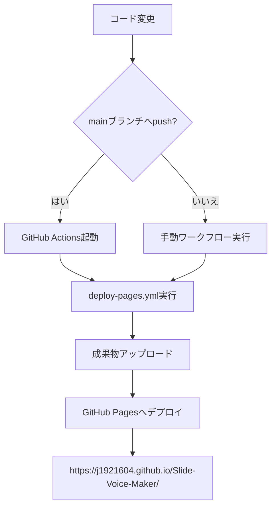
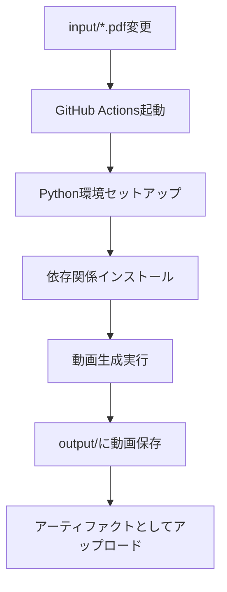

# GitHub Pagesデプロイガイド

**バージョン**: 1.0.0
**日付**: 2026-01-05

## 概要

Slide Voice MakerをGitHub Pagesにデプロイする手順（自動・手動）を説明します。

## デプロイフロー



---

## 自動デプロイ（推奨）

### 前提条件

1. GitHubリポジトリ: https://github.com/J1921604/Slide-Voice-Maker
2. GitHub Pagesが有効化されていること

### 自動デプロイの仕組み

`main`ブランチへpushすると、GitHub Actionsが自動的に実行されます。

#### ワークフローファイル

`.github/workflows/deploy-pages.yml`:

```yaml
name: Deploy to GitHub Pages

on:
  push:
    branches: [ main ]
  workflow_dispatch:

permissions:
  contents: read
  pages: write
  id-token: write

concurrency:
  group: "pages"
  cancel-in-progress: false

jobs:
  deploy:
    environment:
      name: github-pages
      url: ${{ steps.deployment.outputs.page_url }}
    runs-on: ubuntu-latest
    
    steps:
    - name: Checkout
      uses: actions/checkout@v4
    
    - name: Setup Pages
      uses: actions/configure-pages@v4
    
    - name: Upload artifact
      uses: actions/upload-pages-artifact@v3
      with:
        path: '.'
    
    - name: Deploy to GitHub Pages
      id: deployment
      uses: actions/deploy-pages@v4
```

### デプロイ手順

```bash
# 1. 変更をコミット
git add .
git commit -m "feat: 機能追加"

# 2. mainブランチにプッシュ
git push origin main

# 3. GitHub Actionsが自動実行
# 4. 約1-2分後にGitHub Pagesに反映
```

### 確認方法

1. GitHubリポジトリ → 「Actions」タブを開く
2. 「Deploy to GitHub Pages」ワークフローの実行状況を確認
3. 成功後、https://j1921604.github.io/Slide-Voice-Maker/ にアクセス

---

## 手動デプロイ

### GitHub Actions手動実行

1. GitHubリポジトリ → 「Actions」タブを開く
2. 「Deploy to GitHub Pages」ワークフローを選択
3. 「Run workflow」ボタンをクリック
4. ブランチを選択（通常は`main`）
5. 「Run workflow」で実行

### ローカルビルド＆確認

```bash
# ローカルサーバーで確認
py -3.10 -m http.server 8000

# ブラウザで http://localhost:8000 を開く
```

---

## GitHub Pages初回設定（手動）

### 設定手順

1. GitHubリポジトリを開く
2. 「Settings」→「Pages」を選択
3. **Source**: 「GitHub Actions」を選択
4. 保存

### 設定画面


### 確認事項

| 設定項目 | 値 |
|----------|-----|
| Source | GitHub Actions |
| Branch | main（参照用） |
| Folder | / (root) |
| Custom domain | （任意） |
| Enforce HTTPS | ✅ 推奨 |

---

## トラブルシューティング

### ワークフローが失敗する場合

1. **権限エラー**
   - Settings → Actions → General → Workflow permissions
   - 「Read and write permissions」を選択

2. **Pages未設定**
   - Settings → Pages → Source: GitHub Actions

3. **ブランチ保護ルール**
   - mainブランチへのpush権限を確認

### デプロイ後にページが表示されない

1. ブラウザキャッシュをクリア（Ctrl+Shift+R）
2. 数分待ってから再確認
3. GitHubのステータスページを確認: https://www.githubstatus.com/

### index.htmlが見つからない

- リポジトリルートにindex.htmlが存在することを確認
- ファイル名が小文字であることを確認

---

## 動画生成ワークフロー

PDF変更時に動画を自動生成する別ワークフローも用意されています。

`.github/workflows/generate-video.yml`:



### 手動実行方法

1. Actions → 「Generate Video from PDF」を選択
2. 「Run workflow」をクリック
3. 生成完了後、Artifactsから動画をダウンロード

---

## 関連リンク

- リポジトリ: https://github.com/J1921604/Slide-Voice-Maker
- GitHub Pages: https://j1921604.github.io/Slide-Voice-Maker/
- 機能仕様書: https://github.com/J1921604/Slide-Voice-Maker/blob/main/specs/001-Slide-Voice-Maker/spec.md
- クイックスタート: https://github.com/J1921604/Slide-Voice-Maker/blob/main/specs/001-Slide-Voice-Maker/quickstart.md
