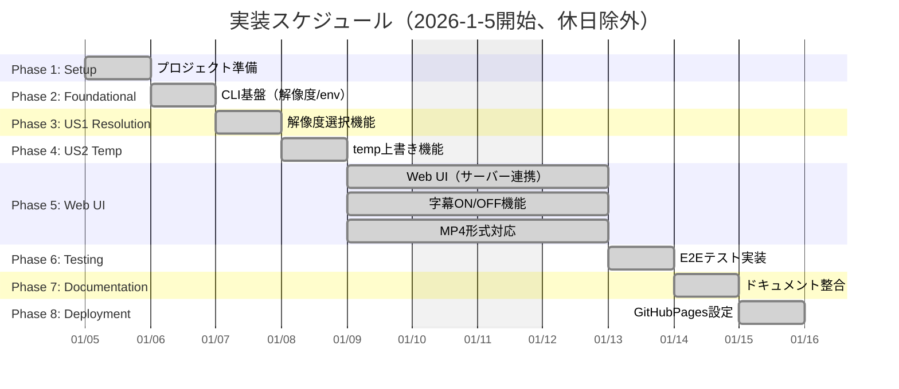
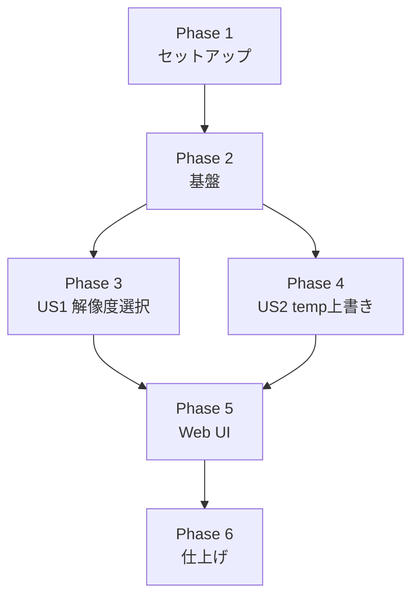

# タスク一覧: Slide MyVoice Maker

**入力**: `/specs/001-Slide-MyVoice-Maker/` からの設計ドキュメント
**前提条件**: plan.md（必須）、spec.md（必須）、data-model.md、contracts/
**バージョン**: 1.0.0
**開始日**: 2026-1-5

## 形式: `[ID] [P?] [ストーリー?] 説明`

- **[P]**: 並列実行可能（異なるファイル、依存関係なし）
- **[US1]**: ユーザーストーリー1（解像度選択）
- **[US2]**: ユーザーストーリー2（temp上書き更新）

---

## 実装スケジュール



**注意**: 
- 基準開始日: 2026-1-5
- 休日除外: 土日・年末年始（12/27-1/4）
- 相対日付: `after`キーワードで自動調整
- 基準日変更時: 最初のタスク日付を変更すれば全体が調整されます

---

## Phase 1: セットアップ

**目的**: プロジェクト構造確認と仕様ドキュメント作成

- [x] T001 specs/001-Slide-MyVoice-Maker/フォルダを作成
- [x] T002 [P] spec.md（機能仕様書）を作成
- [x] T003 [P] plan.md（実装計画）を作成

**チェックポイント**: ドキュメント準備完了 ✅

---

## Phase 2: 基盤（ブロッキング前提条件）

**目的**: 解像度選択・temp管理の共通インフラ構築

**⚠️ 重要**: このフェーズが完了するまでユーザーストーリー作業は開始不可

- [x] T004 src/main.pyにRESOLUTION_MAP定数を定義（720p/1080p/1440p→幅ピクセル）
- [x] T005 [P] src/main.pyに--resolution引数をargparseに追加
- [x] T006 [P] 環境変数OUTPUT_MAX_WIDTHへの変換処理を実装

**チェックポイント**: 基盤準備完了 - ユーザーストーリー実装を開始可能 ✅

---

## Phase 3: ユーザーストーリー1 - 解像度選択（優先度: P1）🎯 MVP

**目標**: ユーザーが動画生成前に出力解像度（720p/1080p/1440p）を選択可能にする

**独立テスト**: `py -3.10 src/main.py --resolution 1080p`を実行し、出力動画の解像度が1920x1080であることをFFprobeで確認

### ユーザーストーリー1の実装

- [x] T007 [US1] src/main.pyで--resolution引数をパースしRESOLUTION_MAPから幅を取得
- [x] T008 [US1] src/main.pyで取得した幅をos.environ["OUTPUT_MAX_WIDTH"]に設定
- [x] T009 [US1] src/processor.pyの_get_output_max_width()が環境変数を正しく読み取ることを確認
- [x] T010 [US1] 無効な解像度値の場合は720p（デフォルト）にフォールバックするバリデーション追加

**チェックポイント**: 解像度選択機能が独立して動作 ✅

---

## Phase 4: ユーザーストーリー2 - temp上書き更新（優先度: P1）

**目標**: 毎回の実行時にtempフォルダを自動クリアし、古いファイルを残さない

**独立テスト**: 2回連続で動画生成を実行し、output/temp/内に1回目のファイルが残っていないことを確認

### ユーザーストーリー2の実装

- [x] T011 [US2] src/processor.pyにclear_temp_folder(temp_dir)関数を追加
- [x] T012 [US2] clear_temp_folder()内でshutil.rmtree()とos.makedirs()を使用
- [x] T013 [US2] process_pdf_and_script()の冒頭でclear_temp_folder()を呼び出し
- [x] T014 [P] [US2] PermissionError時のエラーハンドリングとログ出力追加

**チェックポイント**: temp上書き機能が独立して動作 ✅

---

## Phase 5: Web UI（優先度: P1）

**目標**: サーバー（src/server.py）と連携するWeb UI

**独立テスト**: index.htmlでPDF/CSV入力→音声生成→WebMダウンロードが可能であることを確認

### Web UIの実装

- [x] T015 index.htmlにRESOLUTION_OPTIONS配列を定義（label, value, width, height）
- [x] T016 index.htmlにサーバー連携機能を実装（PDF/CSVアップロード、動画生成、ダウンロード）
- [x] T017 src/server.pyにFastAPIエンドポイントを実装（PDF/CSVアップロード、動画生成、ファイル一覧、ダウンロード）
- [x] T018 CSV文字化け対処をTextDecoderベースに強化（UTF-8/Shift_JIS等 + RFC4180最小対応）

**チェックポイント**: Web UIが独立して動作 ✅

---

## Phase 6: 仕上げとテスト

**目的**: E2Eテスト実行、ドキュメント更新、最終検証

- [x] T019 [P] tests/e2e/test_resolution.pyでCLI E2Eテスト（解像度・非空WebM確認）
- [x] T020 [P] tests/e2e/test_local_backend.pyでバックエンドE2Eテスト
- [x] T021 [P] README.mdを要件/テスト/実行手順に整合
- [x] T022 [P] docs/完全仕様書.mdを現行仕様に整合
- [x] T023 [P] specs/001-Slide-MyVoice-Maker/{spec,plan,quickstart}.mdを整合（リンクはGitHub URLへ）
- [x] T024 E2Eを実行し100%成功を確認

**チェックポイント**: 全機能テスト・ドキュメント完了

---

## 依存関係と実行順序

### フェーズ依存関係



### ユーザーストーリー依存関係

- **ユーザーストーリー1（P1）**: 基盤（Phase 2）完了後に開始可能 - 他のストーリーへの依存なし
- **ユーザーストーリー2（P1）**: 基盤（Phase 2）完了後に開始可能 - US1とは独立

### 並列実行可能タスク

| Phase | 並列実行可能タスク |
|-------|-------------------|
| Phase 1 | T002, T003 |
| Phase 2 | T005, T006 |
| Phase 5 | T015-T018 |
| Phase 6 | T019-T023 |

---

## 並列例: 基盤完了後

```bash
# 基盤完了後、2つのユーザーストーリーを並列開始可能:
チームA: "ユーザーストーリー1 - 解像度選択"
チームB: "ユーザーストーリー2 - temp上書き"
```

---

## 実装戦略

### MVP優先（ユーザーストーリー1のみ）

1. Phase 1: セットアップを完了 ✅
2. Phase 2: 基盤を完了 ✅
3. Phase 3: ユーザーストーリー1を完了 ✅
4. **停止して検証**: 解像度選択機能を独立してテスト ✅
5. 準備ができたらデプロイ/デモ

### インクリメンタルデリバリー

1. セットアップ + 基盤を完了 → 基盤準備完了 ✅
2. ユーザーストーリー1を追加 → 独立してテスト → デプロイ/デモ（MVP!）✅
3. ユーザーストーリー2を追加 → 独立してテスト → デプロイ/デモ ✅
4. Web UIを追加 → 独立してテスト → デプロイ/デモ ✅
5. 各ストーリーは前のストーリーを壊さずに価値を追加

---

## タスク進捗サマリー

| 項目 | 数値 |
|------|------|
| 総タスク数 | 24 |
| 完了 | 24 |
| 未着手 | 0 |

---

## 注意事項

- Python 3.10.11を使用（`py -3.10`）
- UTF-8エンコーディング必須
- 土日・年末年始（12/27-1/4）はスケジュール対象外
- 各チェックポイントで動作確認を実施
- [P] タスク = 異なるファイル、依存関係なし
- [US*] ラベルはトレーサビリティのためタスクを特定のユーザーストーリーにマップ

## 完了条件

1. すべてのタスクが完了状態になっていること
2. CLI E2Eテスト（T019）が成功すること
3. バックエンドE2Eテスト（T020）が成功すること
4. ドキュメント整合（T021-T024）が完了すること
