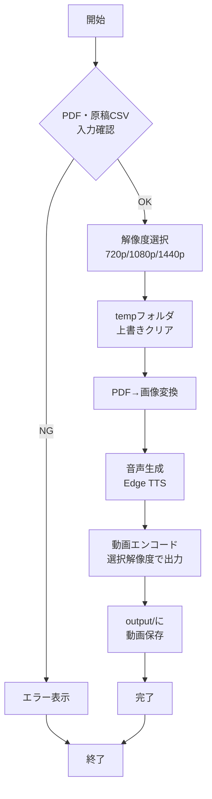
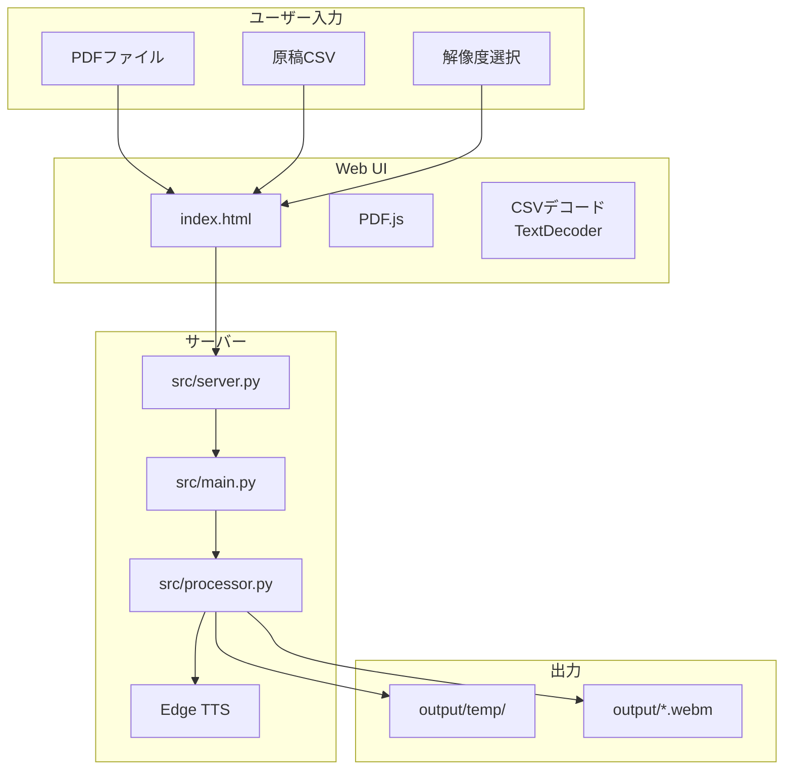
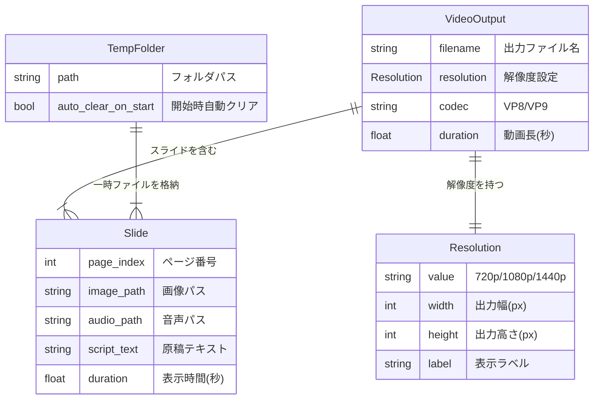

# 機能仕様書: Slide Voice Maker

**機能ブランチ**: `001-Slide-Voice-Maker`
**作成日**: 2026-01-05
**バージョン**: 1.0.0
**状態**: 承認済

## 概要

Slide Voice Makerは、PDFスライドと原稿CSVからAI音声ナレーション付き動画（WebM）を自動生成するツールである。

本仕様では以下の機能を定義する:

1. **出力動画の解像度選択**: ユーザーが動画出力時に解像度（720p/1080p/1440p）を選択可能にする
2. **temp上書き更新**: 毎回の実行時にoutput/tempフォルダを上書き更新し、古いファイルを自動削除する

加えて、運用上の必須要件として以下を定義する:

- **機能（src/server.py起動時）**:
  - PDF入力ボタン実行で、inputフォルダにPDFファイルを上書き保存
  - 原稿CSV入力ボタン実行で、inputフォルダにCSVファイルを上書き保存
  - webm解像度プルダウン選択（720p/1080p/1440p）
  - 音声生成ボタン実行で、output/tempフォルダに上書き更新、output/に動画webm上書き更新
  - 動画webm出力ボタン実行で、outputフォルダに保存した動画webmを選択してダウンロード

- **ホーム画面（PDF未アップロード時）はPDF入力ボタンのみ表示**
- **PDFアップロード後の画面では原稿CSV入力ボタンを維持**（文字化け対処のため）

## プロセスフロー



## システムアーキテクチャ



### ユーザーストーリー1 - 出力解像度の選択（優先度: P1）

ユーザーは動画生成前に出力解像度を選択し、用途に応じた品質の動画を生成できる。

**この優先度の理由**: プレゼンテーション用途や配信用途で異なる解像度が必要なため、最優先で実装する。

**独立テスト**: 解像度選択UIで720pを選択し、動画生成後にファイルの実解像度が1280x720であることを確認する。

**受入シナリオ**:

| 前提条件 | 操作 | 期待結果 |
|----------|------|----------|
| PDFと原稿CSVがinputフォルダにある | 解像度1080pを選択して動画生成 | 出力動画の解像度が1920x1080 |
| 解像度未選択 | 動画生成を実行 | デフォルト1280x720で動画生成 |

---

### ユーザーストーリー2 - temp上書き更新（優先度: P1）

ユーザーは毎回の実行時にtempフォルダが自動的にクリアされ、古いファイルが残らない。

**この優先度の理由**: ディスク容量の圧迫防止と、混乱の原因となる古いファイルの除去のため最優先。

**独立テスト**: 2回連続で動画生成を実行し、tempフォルダ内に1回目のファイルが残っていないことを確認する。

**受入シナリオ**:

| 前提条件 | 操作 | 期待結果 |
|----------|------|----------|
| tempフォルダに過去の生成ファイルがある | 新しいPDFで動画生成 | 過去のファイルは削除され新しいファイルのみ存在 |
| tempフォルダが存在しない | 動画生成を実行 | tempフォルダが作成されファイルが生成される |

---

### エッジケース

- 解像度選択が無効な値の場合、デフォルト720pにフォールバック
- tempフォルダ削除中にファイルがロックされている場合、エラーログを出力して続行
- 非常に大きなPDF（100ページ超）の場合、進捗表示を行う

## 機能要件

| ID | 要件 | 優先度 |
|----|------|--------|
| FR-001 | システムは720p/1080p/1440pの解像度オプションを提供しなければならない | P1 |
| FR-002 | システムはデフォルト解像度として720p（1280x720）を使用しなければならない | P1 |
| FR-003 | システムは動画生成前にtempフォルダを自動的にクリアしなければならない | P1 |
| FR-004 | システムは解像度設定を環境変数OUTPUT_MAX_WIDTHで制御可能にしなければならない | P1 |
| FR-005 | システムはindex.html（Web UI）に解像度選択UIを追加しなければならない | P1 |
| FR-006 | システムはPython版（src/main.py）にコマンドライン引数--resolutionを追加しなければならない | P1 |
| FR-007 | システムはUTF-8エンコーディングで全ファイルを処理しなければならない | P1 |

## 解像度マッピング

| 選択肢 | 幅（px） | 高さ（px） | 環境変数値 |
|--------|----------|------------|------------|
| 720p   | 1280     | 720        | 1280       |
| 1080p  | 1920     | 1080       | 1920       |
| 1440p  | 2560     | 1440       | 2560       |

## 主要エンティティ



## 成功基準

| ID | 基準 | 測定方法 |
|----|------|----------|
| SC-001 | 解像度選択から動画生成完了まで、スライド1枚あたり10秒以内 | 処理時間計測 |
| SC-002 | temp上書きによりディスク使用量が前回生成分のみに制限される | ファイルサイズ確認 |
| SC-003 | 選択した解像度と出力動画の実解像度が100%一致する | FFmpegログ解析で検証 |
| SC-004 | Web UIで解像度選択が正常に動作する | E2Eテスト |

## 技術スタック

| 項目 | 技術 |
|------|------|
| 言語 | Python 3.10.11 |
| 音声合成 | Edge TTS |
| 動画編集 | MoviePy < 2.0 |
| PDF処理 | PyMuPDF (fitz) |
| 動画エンコード | FFmpeg (VP8/VP9) |
| Web UI | React 18 + Tailwind CSS + PDF.js |
| サーバー | FastAPI + Uvicorn |

## 依存関係

```
edge-tts
moviepy<2.0
pymupdf
pandas
imageio-ffmpeg
pytest
playwright
```
